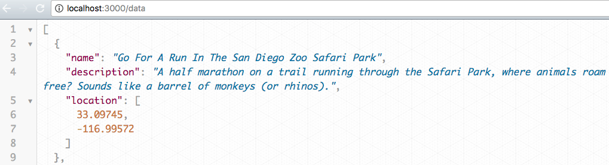

# Express Server
> Uses an Express framework to build a simple server to serve an entire directory and some data for an application.

This was my fifth project at Origin Code Academy. This server was created using NodeJS and Express.



## Approach

This app demonstrates running a server using NodeJS with the Express framework.

## Installation

Download all associated files and load them up in your favorite text editor!

## Development setup

This app relies on NodeJS for its functionality. I recommend using nodemon [nodemon](https://www.npmjs.com/package/nodemon) to run this server.

```sh
npm install -g nodemon
// cd to-your-web-folder
nodemon server
```

## Contact Information

Twitter: [@adriftinthesea](https://twitter.com/adriftinthesea)

Email: z@zamarise.com

GitHub: [https://github.com/zamarise](https://github.com/zamarise/)
